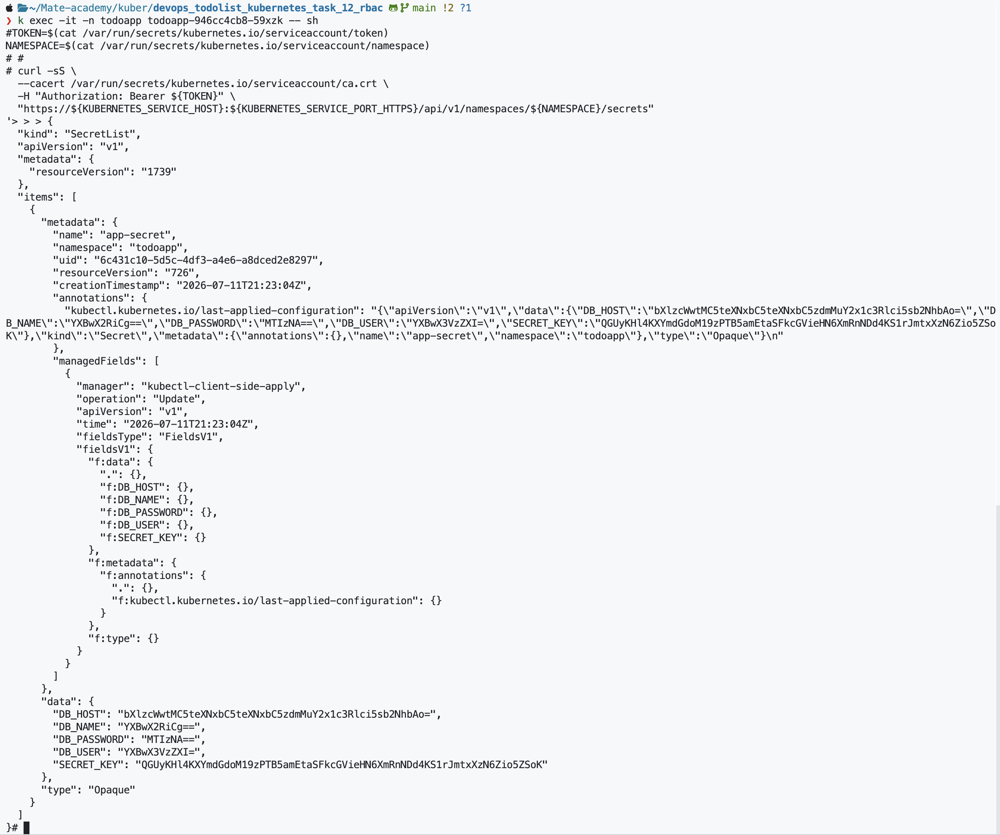

# RBAC Validation Instructions

This document explains how to validate that the application Deployment uses the configured ServiceAccount and that the ServiceAccount can list Secrets in the `todoapp` namespace.

## Prerequisites

- Docker
- `kind`
- `kubectl`
- A running Kubernetes cluster created for this project

## 1. Deploy the resources

Run the bootstrap script from the repository root:

```bash
./bootstrap.sh
```

Alternatively, apply the RBAC and Deployment manifests separately:

```bash
kubectl apply -f .infrastructure/security/rbac.yml
kubectl apply -f .infrastructure/app/deployment.yml
```

## 2. Validate the RBAC resources

Check that the ServiceAccount, Role, and RoleBinding exist in the `todoapp` namespace:

```bash
kubectl get serviceaccount todoapp-service-account -n todoapp
kubectl get role todoapp-secret-reader -n todoapp
kubectl get rolebinding todoapp-rolebinding -n todoapp
```

Inspect the permissions assigned to the Role:

```bash
kubectl describe role todoapp-secret-reader -n todoapp
```

The Role must allow the `list` verb for the `secrets` resource.

Confirm the effective permission of the ServiceAccount:

```bash
kubectl auth can-i list secrets \
  --namespace=todoapp \
  --as=system:serviceaccount:todoapp:todoapp-service-account
```

Expected output:

```text
yes
```

## 3. Validate the Deployment ServiceAccount

Check which ServiceAccount is configured in the Deployment pod template:

```bash
kubectl get deployment todoapp -n todoapp \
  -o jsonpath='{.spec.template.spec.serviceAccountName}{"\n"}'
```

Expected output:

```text
todoapp-service-account
```

Wait until the Deployment is available:

```bash
kubectl rollout status deployment/todoapp -n todoapp
kubectl get pods -n todoapp
```

## 4. List Secrets from a Deployment pod

Open a shell in one of the Deployment pods:

```bash
kubectl exec -it -n todoapp deployment/todoapp -- sh
```

Inside the pod, read the mounted ServiceAccount token and namespace:

```bash
TOKEN=$(cat /var/run/secrets/kubernetes.io/serviceaccount/token)
NAMESPACE=$(cat /var/run/secrets/kubernetes.io/serviceaccount/namespace)
```

Use the token to request the namespace Secrets from the Kubernetes API:

```bash
curl -sS \
  --cacert /var/run/secrets/kubernetes.io/serviceaccount/ca.crt \
  -H "Authorization: Bearer ${TOKEN}" \
  "https://${KUBERNETES_SERVICE_HOST}:${KUBERNETES_SERVICE_PORT_HTTPS}/api/v1/namespaces/${NAMESPACE}/secrets"
```

A successful response contains:

```json
{
  "kind": "SecretList",
  "apiVersion": "v1",
  "items": []
}
```

The `items` array contains the Secrets available in the `todoapp` namespace. The exact fields and values depend on the Secrets currently deployed.

Exit the container shell when validation is complete:

```bash
exit
```

## Validation result

The following screenshot demonstrates a successful request from the application pod. The Kubernetes API returned a `SecretList` containing the `app-secret` Secret:


